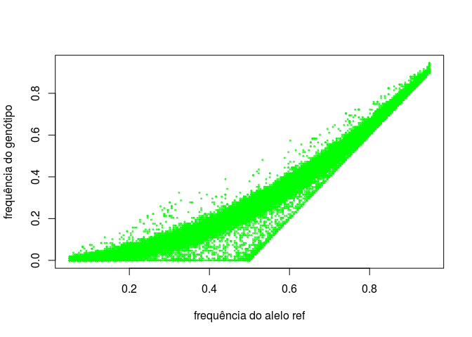
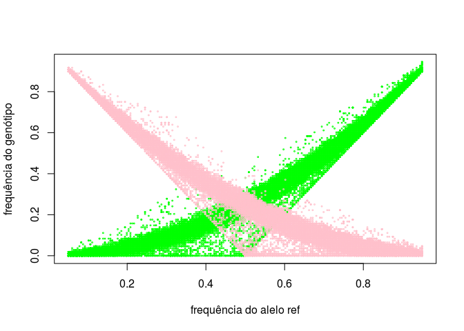
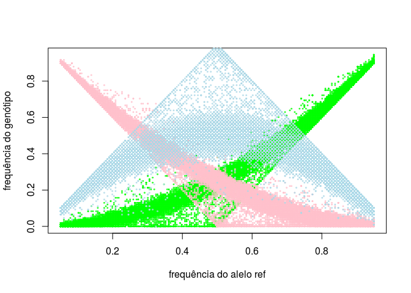
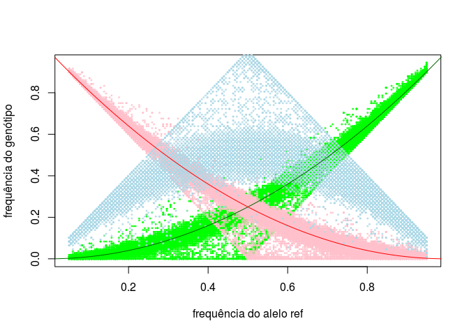

Roteiro para plot HWE
================

Importar os dados de contagens genotípicas para o R. Lembre que essas contagens foram geradas pelo comando `vcftools --hardy` e parseadas pelo script `parse_genocounts.R`.

``` r
genos <- read.table("./results/chr21.yri.genotypecounts.tsv", header = TRUE)
```

Criar colunas no data.frame `genos` que se referem às frequências do genótipos e dos alelos, a partir das contagens observadas dos genotótipos.

``` r
# total of individuals
total_ind <- genos$ref_ref + genos$ref_alt + genos$alt_alt

# REF allele frequencies
genos$f_ref <- (genos$ref_ref + genos$ref_alt/2) / total_ind
genos$f_alt <- 1 - genos$f_ref

#genotype frequencies
genos$f_ref_ref <- genos$ref_ref / total_ind
genos$f_ref_alt <- genos$ref_alt / total_ind
genos$f_alt_alt <- genos$alt_alt / total_ind
```

Fazer gráfico das frequências do alelo REF x frequência do genótipo REF-REF

``` r
plot(genos$f_ref, genos$f_ref_ref, col = "green", cex = .25, 
     xlab = "frequência do alelo ref", ylab = "frequência do genótipo")
```



Então adicionamos os pontos para frequências do genótipo ALT-ALT. Adicionamos pontos a um gráfico já existente com a função `points`.

``` r
points(genos$f_ref, genos$f_alt_alt, col = "pink", cex = .25)
```



E então os pontos para as frequências do genótipo REF-ALT

``` r
points(genos$f_ref, genos$f_ref_alt, col = "lightblue", cex = .25)
```



Finalmente, vamos adicionar as linhas teóricas, ou seja, correspondendo às frequências genotípicas esperadas por HWE.

Primeiro vamos usar a função `seq` para criar um vetor de frequências para um alelo hipotético. Essas frequências vão variar de 0 a 1 em passos de 0.01.

``` r
f <- seq(0, 1, 0.01)
```

Adicionamos linhas com a função `lines`. Para os homozigotos REF:

``` r
lines(f, f^2, col = "darkgreen")
```


Para os homozigotos ALT:

``` r
lines(f, (1-f)^2, col = "red")
```



Para os heterozigotos:

``` r
lines(f, 2 * f * (1-f), col = "blue")
```


