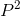

Deriva Genética
==========================================

O objetivo dessa prática é usar simulações para ilustrar conceitos básicos de deriva genética. 

## O conceito básico de deriva e um simulador básico

Vimos na aula que a deriva genética pode ser definida do ponto de vista biológico: oscilações em
frequências alélicas resultantes do tamanho finito das populações.

Podemos também escrever algumas expressões matemáticas que descrevem a
trajetória temporal da diversidade genética. Essas fórmulas mostram que a queda
de diversidade genética por deriva é inversamente proporcional ao tamanho da
população.

Vimos em aula expressões para o aumento da probabilidade de identidade por descedência e declínio de heterozigose:

F_t = 1 - (1 - 1/2N)^t

H_t = H0 (1 - 1/2N)^t

Uma outra forma de estudar a deriva envolve fazer simulações desse processo no
computador. Simulações recriam o processo biológico, porém com as regras
completamente controladas pelo pesquisador.

Exercício 1. Baseado no que você entende sobre deriva genética, proponha, em palavras, um algoritmo que seja capaz se simular o processo. Repare que há diferentes simulações que são possíveis, de modo que é importante você explicitar que pressupostos está usando. Essa primeira etapa deve ser feita em "palavras", aquilo que os programadores chamam de pseudcódigo.

## Simulando o aumento de IBD com o tempo: uma única população

Lembre que a quantidade cuja trajetória temporal queremos descrever é a probabilidade de identidade por descedência. Em relação a uma "população de referência", isso equivale a perguntar qual a probabilidade de amostrar duas cópias gênicas que descendem de uma mesma cópia gênica na geração original?

Para explorar a trajetória temporal do IBD, examine o código em no arquivo [ibd_single_pop.R](https://github.com/genevol-usp/curso-genomica-evolutiva/blob/master/dia2/ibd_single_pop.R). Execute cada passo desse código, buscando entender o que ele está fazendo, até que esteja confortável com essa representação da deriva genética.

**Questão 1.** Altere o valor de N e veja o efeito sobre a trajetória temporal de IBD. 

## Simulando o aumento de IBD com o tempo: várias populações

Já criamos um arquivo um arquivo que realiza essa simulação múltipolas vezes, e também inclui a média para esse conjunto. Esse material está no arquivo [ibd_many_pops.R](https://github.com/genevol-usp/curso-genomica-evolutiva/blob/master/dia2/ibd_many_pops.R)

**Questão 2.** Em genética de populações, uma estratégia importante para avaliar se as simulações estão programadas de modo correto envolve comparar os resultados simulados com aqueles esperados pela teoria. Usando a fórmula para o aumento da probabilidade de identidade por descendência ao longo do tempo, inclua uma linha que indique a trajetória esperada, dado o valor de N. Compare com o valor simulado. A teoria parece estar funcionando? 

## Tempo de fixação para uma mutação

O conceito de IBD é fundamental, pois nos ilustra que, invevitavelmente, com o passar do tempo todas as mostras serão descendentes de um único ancestral que exisitiu no passado. Quanto tempo demora, em média, para que uma mutação percorra o trajeto entre estar presente em uma única cópia até se fixar? A teoria de genética de populações tem algumas demonstrações desse resultado. Mas as simulações também podem demonstrá-lo.

**Questão 3.** Use o script [fix_time.R](https://github.com/genevol-usp/curso-genomica-evolutiva/blob/master/dia2/fix_time.R), que simula o processo de deriva, e veja se a expectativa teórica é observada. Para isso, compare o tempo médio até a fixação de uma das cópias gênicas presentes na população original com a expectativa teórica, 4N (lembrando que o N aqui refere-se ao número de indivíduos diplóides; tome cuidado para ver se isso correspodne ao uso de N feito nas simulações!). 

## Deriva genética para um lócus bialélico

A forma mais habitual de se ilustrar o processo de deriva envolve a trajetória temporal para um lócus bialélico. São os gráficos comumente usados em livro texto, e presentes no capítulo de Hedrick, que vocês leram. Use o código presente no arquivo [drift_single_pop.R](https://github.com/genevol-usp/curso-genomica-evolutiva/blob/master/dia2/drift_single_pop.R) para entender como se gera tal gráfico, e cerfitique-se que compreender como cada estapa está sendo feito.

**Questão 4.** Usando o arquivo [drift_multiple_pops.R](https://github.com/genevol-usp/curso-genomica-evolutiva/blob/master/dia2/drift_multiple_pops.R) gere  gráficos que ilustram o processo de deriva, variando o valor de N e as frequências iniciais, e veja o efeito sobre as trajetórias temporais e probabilidades de fixação. Repetindo as simulações um grande número de vezes, certifique-se que de fato a probablidade de fixação é dada pela frequência inicial do alelo.

**Questão 5.** Nós incluímos no código também um cálculo de como a taxa de heterozigose (H) muda ao longo do tempo, tanto para populações individuais, como para a média do conjunto de populações. Sua tarefa é investigar se o declínio de H ao longo do tempo se dá de acordo com a expectativa teórica. Para fazer isso, relembre a equação a ser usado e inclua-a no gráfico para a trajetória simulada de H.

## Deriva genética numa população com tamanho variável: o efeito gargalo

- Até aqui, fizemos simulações com populações de tamanho constante. Introduza uma variação no tamanho populacional, simulando um gargalo. Usando as fórmulas para o tamanho efetivo populacional, veja se a perda de diversidade observada se encaixa com aquela esperada de acordo com o tamanho efetivo.

E aqui vai um teste de fórmula , uma bem simples.
