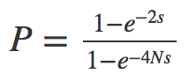
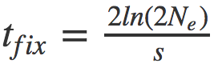

Roteiro para discussões sobre seleção natural
=============================================

## Modelo determinístico de seleção natural

No texto “Theory of selection in populations”, Kent Holsinger revisa o conceito básico de seleção natural e apresenta uma fórmula que prevê como a frequência de um alelo (dada por p) numa geração difere daquela da geração anterior, supondo que a seleção esteja ocorrendo.

Usando a fórmula (1) apresentada no texto e a linguagem de programação como R, mostre como uma mutação vantajosa aumenta de frequência ao longo do tempo (decida o número de gerações necessário para ilustrar o processo do modo mais claro). Vamos supor que o coeficiente de seleção associado à mutação seja de 0.05 (ou seja, s=0.05). Com esse valor é possível calcular o valor adaptativo de cada genótipo. Suponha que a frequência inicial da mutação é de 1% e faça seus cálculos para dois cenários, dados abaixo em (a) e (b).

(a) A mutação é vantajosa e recessiva (a vantagem só se faz presente quando duas cópias da mutação estão presentes, ou seja WAA > WAa e WAA>Waa)

(b) A mutação é vantajosa e dominante (indivíduos heterozigotos para a mutação têm o mesmo valor adaptativo, ou seja WAA=WAa, e ambos são maiores que Waa)

## Modelo de seleção que incorpora deriva

Para contrastar o modelo determinístico de seleção natural com um que contempla tanto os efeitos de deriva e seleção, use um simulador escrito em R, disponível no seguinte site:

https://phytools.shinyapps.io/drift-selection/

Faça simulações para valores adaptativos de WAA=1.00; WAa=0.95; Waa=0,90, com frequência inicial do alelo em 0.05. Varie o tamanho da população e discuta o efeito sobre as trajetórias e as probabilidades de fixação da mutação vantajosa. O que acontece se você reduz a frequência inicial do alelo vantajoso para 0,01? De modo geral, a partir de quais combinações de tamanho populacional e intensidade de seleção os afeitos estocásticos (introduzidos pela deriva) passam a dominar?

## Probabilidade de fixação sob seleção e deriva genética

Os padrões gerais vistos no exercício anterior foram investigados de modo analítico por J.B.S. Haldane (1982-1964) Motoo Kimura (1924-1994). Eles descobriram que a probabilidade de fixação de uma mutação vantajosa depende da intensidade de seleção que a favorece e também de sua frequência inicial. No caso especial em que a frequência inicial da mutação é 1/2N (o que equivale a dizer que ela está presente em uma só cópia, pois é “recém surgida”, a fórmula é:

que para valores de s relativamente baixos e N elevado se aproxima de 2s.

De posse desse resultado, considere uma mutação presente em uma única cópia, que ocorre numa população de tamanho N=1000. Contraste as probabilidades de fixação de mutações de dois tipos:

- uma mutação neutra;

- uma mutação que confira uma vantagem de 1% (ou seja s=0,01).

Essa diferença faz sentido para você? Como a probabilidade de fixação no caso de seleção constrasta com o que vimos no modelo determinístico (em que não há deriva)?

Agora imagine que essa mesma mutação vantajosa tivesse surgido numa população de tamanho N=50. Sua previsão para a diferença na probabilidade de fixação entre a mutação neutra e a vantajosa mudaria?

## Usando simulações para testar a teoria

Os resultados anteriores, referentes à probabilidade de fixação, podem ser testados usando simulações. Aliás, é uma prática comum em estudos de genética de populações comparar resultados teóricos com os simulados. Essa abordagem é poderosa, pois caso a teoria seja nova, obter os mesmos resultados que aqueles aqueles da simulação mostra que a teoria está funcionando. Por outro lado se o simulador é novo e a teoria já estabelecida, obter o mesmo resultado indica que o simulador foi programado corretamente.

Utilize o simulador indicado no exercício anterior para ver se a predição teórica é de fato observada. Lembre de ajustar a frequência inicial do alelo para 1/2N, que corresponde à condição de haver apenas uma cópia do alelo presente na população. Para facilitar o exercício, simule casos em que s=0,05 com um tamanho populacional de N=100. Para cada réplica incluam um numero elevado de populações (por exemplo, 100) e registre o número que se fixou. Compare com o valor teórico esperado.

## Tempo até fixação

Outro importante resultado teórico referente à trajetória de mutações diz respeito ao tempo médio que demora para uma mutação surgir e se fixar. Para uma mutação neutra o tempo médio até a fixação é 4N gerações. Já para mutações sob seleção, o tempo médio é dado por:

,

onde o ln refere-se ao logaritmo na base natural.

Utilizando essas expressões, compare o tempo médio até a fixação de uma mutação neutra que surge numa população de N=1000 indivíduos com o tempo até a fixação para uma mutação que confere vantagem de 1% (ou seja, s=0,01), também numa população de N=1000. A diferença nesses tempos dá alguma ideia sobre como podemos buscar identificar regiões do genoma que estiveram sob os efeitos de seleção natural?
