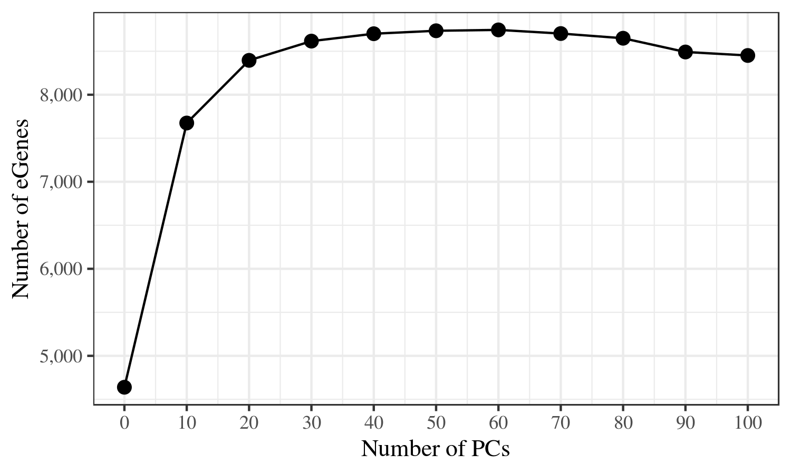

# Mapeamento de variantes que influenciam traços quantitativos

quiz: https://forms.gle/pmwTNEcRost4ff1r7

As pastas acima refletem a organização da análise que faremos hoje:

1. Primeiro, vamos estimar expressão gênica para 87 indivíduos Yoruba, para os quais RNA-seq do mRNA total foi disponibilizado pelo consórcio Geuvadis.

2. Em posse das quantificações de expressão para cada gene, e dos genótipos genome-wide disponíveis a partir do Projeto 1000 Genomas para esses mesmos indivíduos, vamos tentar localizar as variantes genéticas associadas à expressão de cada gene (eQTLs).

3. Finalmente, vamos cruzar os dados de eQTL com aqueles de GWAS. A maior parte das variantes de GWAS estão presentes em regiões não codificadoras do genoma. Tentar correlacionar essas variantes com eQTLs é uma forma de tentar propor mecanismos para a ação de variantes GWAS sobre os genes.

## 1. Expressão

Entre na pasta 1-expression com:

```
cd 1-expression
```

Aqui o script `0-download_data.sh` mostra como fazer o download do arquivo fasta com a sequência anotada de todos os transcritos humanos no Gencode. Não há necessidade de executá-lo, pois já disponibilizamos esse arquivo para vocês.

Agora vamos estimar expressão. Para isso, vamos usar o estimador de expressão Salmon. O 1º passo é criar um índice para o alinhamento a partir dos transcritos do Gencode que baixamos. Podemos fazer isso com o script `1-salmon_index.sh`, porém já executamos esse passo. O índice foi salvo em `/scratch/bio5789/transcripts_index`

Vamos agora estimar expressão para os 87 indivíduos YRI com o script `2-salmon_quant.sh`. A linha 7 desse script traz a seguinte informação:

```
#PBS -t 1-87
```

Vamos modifica-la de forma que cada aluno execute a quantificação para um subconjunto de indivíduos, de forma que no fim tenhamos o dado completo. Ou seja, se um aluno ficar responsável pelos indivíduos 9, 10, 11 e 12, deve modificar essa linha para:

```
#PBS -t 9-12
```

Apesar de esse ser um script `.sh`, ele não é executável. Ao invés de executá-lo, vamos submete-lo para a fila do servidor, que gerenciará a execução. Fazemos isso com:

```
qsub 2-salmon_quant.sh
```

Pronto, quando os processos terminarem de correr, teremos estimativas de expressão.

## 2. eQTLs

Então vamos proceder para o mapeamento de eQTLs na pasta `2-eqtl_map`:

```
cd ../2-eqtl_map
```

Para mapear eQTLs vamos usar o programa QTLtools.

### 2.1 Genótipos

Primeiro vamos processar os genótipos. Esse processamento é o mesmo que fizemos no 1º dia de aula, ou seja, selecionar dos VCFs do 1000 Genomas os indivíduos YRI, variantes bialélicas, com MAF > 5%, etc. Como vocês já fizeram antes, não vamos executar esse passo. O arquivo já processado está em:

```
/scratch/bio5789/genotypes/ALL.chrs.yri.biallelic.maf.vcf.gz
```

Vamos correr um PCA dos genótipos para capturar a estrutura populacional.

A escolha de quantos PCs usar é normalmente baseada numa análise visual do gráfico de PCs. Ou seja, usamos todos os PCs que separam as populaçõess/subpopulações na nossa amostra. Como estamos usando apenas indivíduos YRI, não temos muita separação. Compare com o [gráfico para os indivíduos europeus](https://github.com/genevol-usp/curso-genomica-evolutiva/blob/master/dia6/2-eqtl_map/0-genotypes/PCA_em_europeus.png) do 1000 Genomas também incluídos no consórcio Geuvadis.

Mesmo assim, por recomendação do Geuvadis, vamos incluir os PCs 1 e 2.

Agora vamos correr o script 4-make_covariates.R apenas para formatar o dado de PCs para utilizar no mapeamento de eQTL como covariável.

Agora vamos preparar os dados de expressão.

### 2.2 Fenótipos

```
cd ../0-phenotypes
```

Vamos correr o script `1-write_bed.R` para ler as estimativas de expressão dos 87 indivíduos, selecionar apenas transcritos codificadores de proteína, e salvar um arquivo BED.

```
Rscript 1-write_bed.R
```

Agora vamos correr PCA também no dado de expressão. O raciocínio é que os PCs devem capturar variáveis técnicas escondidas nos dados, para as quais devemos corrigir.

```
./2-run_pca_on_phenotypes.sh
```

Em seguida escrevemos arquivos com números incrementais de PCs:

```
Rscript 3-make_covariates_phenotypes.R
```

E usamos o QTLtools para criar uma versão do dado de expressão corrigido para cada quantidade de PCs nesses arquivos:

```
./4-run_qtltools_correct.sh
```

Tendo preparado os dados, vamos para a análise em si.

### 3. Permutações

```
cd ../1-permutations
```

Uma maneira de ver quantas variáveis técnicas afetam nossos dados de expressão é uma puramente empírica. Corremos a análise de eQTLs para todas as versões dos dado corrigidos por números de PC diferentes, e escolhemos aquele que gera mais eQTLs.

Por exemplo, no subconjunto de indivíduos europeus (N = 358), observamos o seguinte padrão.



No dataset de indivíduos YRI, nós corremos previamente essa análise e vimos que 20 PCs maximizam a descoberta de eQTLs. Portanto vamos usar esse valor.

Aqui novamente cada aluno terá que colaborar para termos a análise completa, editando a linha 6 com os jobs de sua responsabilidade, e então submeter com:

```
qsub 1-run_qtltools_perm.sh
```

Quando terminar, vamos correr uma correção pra testes múltiplos, usando FDR = 5% (apenas 1 pessoa rodar):

```
./2-runfdr.sh
```

Finalmente, vamos fazer a análise condicional para descobrir eQTLs independentes para um mesmo gene.

```
cd ../2-conditionalpass
```

Vamos submeter os jobs com:

```
qsub 1-run_qtltools_conditional.pbs
```

E então apenas compilar os resultados de todos os jobs num único arquivo:

```
./2-compile_results.sh
```

## 3. GWAS

Tendo mapeado os eQTLs, uma análise interessante é tentar colocaliza-los com GWAS hits.

```
cd ../3-snps_gwas
```

O script `0-prepare_input.sh` indica os arquivos de input que precisamos baixar e processar para essa análise. Não é necessário executa-lo pois já fizemos esse pré-processamento.

Vamos filtrar o catálogo de variantes GWAS para manter somente aquelas com p-valor menor que 10^-8:

```
Rscript 1-filter_gwascatalog.R
```

Agora em posse de GWAS e eQTLs, vamos cruzar os dados com o QTLtools (cada aluno pode executar um cromossomo):

```
./2-qtltools_rtc.sh
```

Finalmente, vamos compilar os resultados:

```
Rscript 3-write_results.R
```
